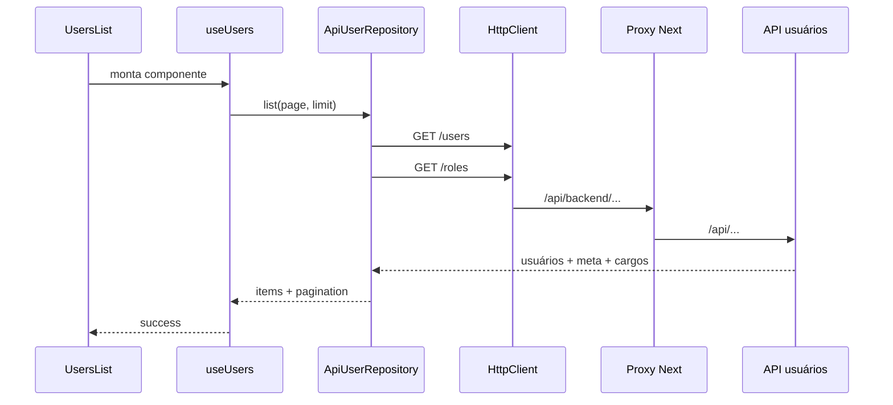

# Guia do projeto API-DSM-4-FRONTEND

Este documento explica a arquitetura do frontend, a responsabilidade das pastas e arquivos e o fluxo completo entre interface, repository, cliente HTTP, proxy do Next e API.

## 1. O que este projeto faz

Este projeto é um portal web construído com:

- Next.js com App Router;
- React;
- TypeScript;
- CSS Modules;
- React Hook Form;
- Zod;
- Vitest e Testing Library.

Áreas existentes:

- administração de usuários;
- detalhes, cadastro, edição e exclusão de usuários;
- administração de parâmetros meteorológicos;
- alertas;
- estações.

A área de usuários está integrada à API real. Parâmetros e alertas ainda usam dados em memória ou mocks.

## 2. Visão geral da arquitetura

O componente não conhece `fetch`, URL ou formato da API. Ele conversa com uma interface de repository.

```mermaid
flowchart LR
    Page[Página Next] --> Component[Componente da feature]
    Component --> Hook[Hook]
    Hook --> Repository[UserRepository]
    Repository --> Mapper[DTO e mapper]
    Repository --> Http[HttpClient]
    Http --> Proxy[/api/backend]
    Proxy --> API[API /api]
```

Essa separação resolve três problemas:

1. a interface pode ser testada com repository falso;
2. os nomes em português do frontend não se misturam aos DTOs em inglês da API;
3. o proxy temporário pode ser removido sem alterar o `ApiUserRepository`.

## 3. Estrutura principal

```text
app/
├── src/
│   ├── app/                 # Rotas do Next
│   ├── components/
│   │   ├── layout/          # Estrutura do portal
│   │   └── ui/              # Componentes visuais reutilizáveis
│   ├── features/            # Código de cada domínio
│   │   ├── users/
│   │   ├── parameters/
│   │   └── alerts/
│   ├── lib/http/            # Infraestrutura HTTP
│   └── test/                # Configuração global de testes
├── public/
├── docs/
├── next.config.ts
├── package.json
├── tsconfig.json
├── vitest.config.mts
└── .env.example
```

## 4. Arquivos da raiz

| Arquivo | Por que existe |
| --- | --- |
| `package.json` | Dependências e scripts de dev, build, lint e testes. |
| `package-lock.json` | Mantém instalações reproduzíveis. |
| `next.config.ts` | Configura o rewrite temporário para a API. |
| `.env.example` | Documenta as variáveis do proxy e do cliente HTTP. |
| `tsconfig.json` | TypeScript estrito, JSX e alias `@/`. |
| `vitest.config.mts` | jsdom, aliases, cobertura e limites mínimos de 80%. |
| `eslint.config.mjs` | Regras do Next, React e TypeScript. |
| `postcss.config.mjs` | Processamento de CSS e suporte ao Tailwind. |
| `.gitignore` | Ignora build, cobertura, dependências e `.env`, mas permite `.env.example`. |
| `AGENTS.md` | Convenções de arquitetura e desenvolvimento do projeto. |

## 5. Variáveis e proxy temporário

O exemplo de ambiente contém:

```env
API_SERVER_URL=http://localhost:3000
NEXT_PUBLIC_API_BASE_URL=/api/backend
```

As duas variáveis têm papéis diferentes:

- `API_SERVER_URL` é lida no servidor Next e aponta para a API real;
- `NEXT_PUBLIC_API_BASE_URL` é incorporada no código do navegador e aponta para o caminho relativo do proxy.

O rewrite em `next.config.ts` faz:

```text
/api/backend/users  → http://localhost:3000/api/users
/api/backend/roles  → http://localhost:3000/api/roles
```

O navegador fala apenas com o Next na mesma origem. Isso evita CORS enquanto não existe gateway ou configuração definitiva no backend.

O proxy está marcado como temporário. Quando for removido, basta mudar `NEXT_PUBLIC_API_BASE_URL`; o `ApiUserRepository` continuará usando `/users` e `/roles` relativos à base.

Como a API usa a porta 3000, execute o frontend em outra porta:

```powershell
npm run dev -- -p 3010
```

## 6. App Router e páginas

### `src/app/layout.tsx`

É o layout raiz do Next. Configura:

- documento HTML;
- fontes Geist;
- metadata padrão;
- CSS global.

### `src/app/globals.css`

Contém reset, tokens globais e estilos compartilhados. CSS específico de componente fica em arquivos `*.module.css`.

### `src/app/page.tsx`

É a página `/`. Ainda mantém o conteúdo inicial do template do Next e não representa o portal administrativo.

### Rotas funcionais

| Arquivo | URL | Função |
| --- | --- | --- |
| `app/administracao/usuarios/page.tsx` | `/administracao/usuarios` | Compõe layout e listagem. |
| `app/administracao/usuarios/[id]/page.tsx` | `/administracao/usuarios/7` | Valida o texto do ID e abre detalhes. |
| `app/administracao/parametros/page.tsx` | `/administracao/parametros` | Administração de parâmetros. |
| `app/alertas/page.tsx` | `/alertas` | Tela de alertas. |
| `app/estacoes/page.tsx` | `/estacoes` | Tela de estações. |

As páginas são pequenas de propósito. Regras e componentes ficam em `features`.

## 7. Componentes de layout

### `PortalLayout`

Monta a estrutura comum:

- link “Pular para o conteúdo”;
- sidebar;
- header;
- `<main>`.

### `Sidebar`

Usa `usePathname()` para marcar a rota ativa. Possui links para usuários, parâmetros, alertas e estações. Itens ainda não implementados podem aparecer desabilitados.

### `Header`

Exibe título da página, indicação de demonstração e botão de notificações ainda indisponível.

Cada componente possui um CSS Module com o mesmo nome. Isso impede que classes locais vazem para outras telas.

## 8. Componentes reutilizáveis de UI

```text
src/components/ui/
├── Badge/
├── Button/
├── FeedbackState/
├── Icon/
├── IconButton/
├── Input/
├── Modal/
├── SearchInput/
└── SidePanel/
```

| Componente | Papel |
| --- | --- |
| `Badge` | Exibe status com variação visual. |
| `Button` | Padroniza botões primários e secundários. |
| `FeedbackState` | Estados de loading, vazio e erro. |
| `Icon` | Centraliza SVGs usados no portal. |
| `IconButton` | Botão acessível cujo conteúdo principal é um ícone. |
| `Input` | Campo com label, erro e atributos acessíveis. |
| `Modal` | Usa `<dialog>`, bloqueia fechamento durante operação e restaura foco. |
| `SearchInput` | Campo de busca com ação de limpar. |
| `SidePanel` | Painel lateral reutilizável. |

Esses componentes não conhecem regras de usuários, parâmetros ou alertas.

## 9. Infraestrutura HTTP

### `src/lib/http/HttpClient.ts`

`FetchHttpClient` é a única camada que usa `fetch` para usuários.

Ele:

- lê `NEXT_PUBLIC_API_BASE_URL`;
- combina base e caminho sem duplicar barras;
- aceita GET, POST, PUT e DELETE por `RequestInit`;
- define `Content-Type: application/json` quando existe body;
- lê JSON somente quando existe conteúdo;
- aceita `204` e respostas vazias;
- transforma falhas HTTP em `HttpError`;
- transforma falha de transporte em `HttpNetworkError`.

`HttpError` preserva:

```ts
status
code
message
details
```

Não existe cabeçalho `Authorization`, cookie de sessão ou lógica JWT.

## 10. Feature de usuários

```text
src/features/users/
├── components/
├── dtos/
├── hooks/
├── mappers/
├── mocks/
├── repositories/
├── schemas/
├── services/
└── types/
```

### Tipos de domínio: `types/user.ts`

Os tipos usados pela interface seguem o vocabulário do frontend:

```ts
User {
  id
  cargo_id
  nome
  ativo
  criado_em
}

UserListItem extends User {
  email
  cargo
}
```

Eles não representam diretamente o JSON da API.

### DTOs: `dtos/userApiDto.ts`

Os DTOs descrevem exatamente o contrato externo:

- `ApiUserDto`;
- `ApiRoleDto`;
- `ApiPaginatedUsersDto`;
- `ApiCreateUserDto`;
- `ApiUpdateUserDto`.

Eles mantêm nomes como `role_id`, `name`, `active` e `created_at` somente na fronteira HTTP.

### Mappers: `mappers/userApiMapper.ts`

Traduz API para domínio:

| API | Frontend |
| --- | --- |
| `role_id` | `cargo_id` |
| `name` | `nome` |
| `active` | `ativo` |
| `created_at` | `criado_em` |
| `email` | `email` |

Também traduz os formulários:

- `cargo_id → role_id`;
- `nome → name`;
- `senha → password`.

`mapApiUser()` recebe a lista de cargos e monta o objeto `cargo` exigido pela tela. Se o cargo do usuário não estiver na resposta de `/roles`, o mapper lança erro em vez de inventar dados.

### Contrato: `repositories/UserRepository.ts`

Define o que a interface precisa, sem dizer se os dados vêm de HTTP ou memória:

```ts
list(options)
listCargos()
create(values)
getById(id)
update(id, values)
delete(id)
```

Também define paginação, limite padrão 20 e validação:

- página inteira maior ou igual a 1;
- limite inteiro entre 1 e 100.

### `ApiUserRepository.ts`

É a implementação real usada pela aplicação.

| Método | Chamada |
| --- | --- |
| `list` | `GET /users?page={page}&limit={limit}` e `GET /roles` |
| `listCargos` | `GET /roles` |
| `getById` | `GET /users/:id` e cargos |
| `create` | `POST /users` |
| `update` | `PUT /users/:id` |
| `delete` | `DELETE /users/:id` |

A lista de cargos é guardada em uma Promise interna. Isso evita repetir `/roles` em cada operação durante a mesma sessão do repository. Se a requisição falhar, o cache é limpo para permitir nova tentativa.

O `PUT` envia apenas:

```json
{
  "role_id": 2,
  "name": "Maria Souza",
  "active": false
}
```

E-mail e senha nunca entram no update.

Um `404` em `getById` vira `null`, permitindo que a tela mostre “Usuário não encontrado”. Outros erros continuam sendo propagados.

O `DELETE` aceita `204` sem body. Um `409` continua sendo um erro conhecido e o modal informa que a exclusão pode estar bloqueada por vínculos.

### `MockUserRepository.ts`

Implementação em memória usada pelos testes. Ela segue o mesmo contrato paginado da API, mas não faz chamadas HTTP.

Não é importada pelo repository de produção. Também não simula cascade de relacionamentos.

### `repositories/index.ts`

É o ponto de composição:

```ts
export const userRepository = new ApiUserRepository();
```

Componentes e hooks importam essa instância por padrão. Nos testes, um mock é injetado explicitamente.

### Schemas dos formulários

#### `schemas/createUserSchema.ts`

Valida:

- nome obrigatório e até 150 caracteres;
- e-mail válido e até 150 caracteres;
- cargo positivo;
- senha com no mínimo 8 caracteres;
- status booleano.

#### `schemas/editUserSchema.ts`

Permite somente:

- nome;
- cargo;
- status.

O e-mail é exibido como somente leitura.

### Hooks

#### `useUsers.ts`

Controla:

- página atual;
- carregamento;
- erro;
- lista de usuários;
- cargos;
- metadados de paginação;
- recarregamento depois de um cadastro.

Ele carrega usuários e cargos em paralelo. Quando a página muda, volta ao estado de loading e pede a próxima página ao repository.

#### `useUserDetails.ts`

Controla:

- busca por ID;
- carregamento e usuário inexistente;
- lista de cargos para edição;
- atualização;
- exclusão;
- travamento contra operações simultâneas;
- mensagem de sucesso.

### Componentes de usuários

| Arquivo | Responsabilidade |
| --- | --- |
| `UsersList.tsx` | Toolbar, estados, busca, filtro, cadastro e paginação. |
| `UsersTable.tsx` | Tabela e links para detalhes. |
| `CreateUserModal.tsx` | Formulário de cadastro e envio ao repository. |
| `UserDetailsScreen.tsx` | Carrega por ID e escolhe loading, erro, vazio ou detalhes. |
| `UserDetails.tsx` | Apresenta dados e abre edição/exclusão. |
| `EditUserModal.tsx` | Edita nome, cargo e status. |
| `DeleteUserModal.tsx` | Confirma exclusão e apresenta possível bloqueio. |

### Busca: `services/searchUsers.ts`

Filtra nome e e-mail sem diferenciar maiúsculas. A busca é local e considera somente a página carregada. Não existe endpoint de busca inventado no frontend.

### Fluxo da listagem



### Fluxo do cadastro

1. O usuário abre `CreateUserModal`.
2. React Hook Form coleta os valores.
3. Zod valida e normaliza.
4. O modal chama `repository.create()`.
5. O mapper converte campos para o POST da API.
6. O `HttpClient` envia JSON pelo proxy.
7. A resposta volta pelo mapper.
8. A lista recarrega a página atual.

### Fluxo de detalhes, edição e exclusão

1. A URL dinâmica entrega o ID para `UserDetailsScreen`.
2. `useUserDetails` chama `getById` e `listCargos`.
3. A edição chama `PUT` sem e-mail ou senha.
4. A exclusão chama `DELETE`.
5. Em sucesso, o router volta para `/administracao/usuarios`.
6. Em conflito, o modal permanece aberto e informa possível vínculo.

## 11. Paginação

A resposta da API:

```json
{
  "data": [],
  "meta": {
    "total_records": 0,
    "total_pages": 0,
    "current_page": 1
  }
}
```

É convertida para:

```ts
{
  items: [],
  pagination: {
    totalRecords: 0,
    totalPages: 0,
    currentPage: 1
  }
}
```

`UsersList` exibe botões acessíveis de página anterior e próxima quando existe mais de uma página.

O frontend não corrige a inconsistência conhecida do backend entre `data` e `total_records`; os metadados são preservados como recebidos.

## 12. Feature de parâmetros

Esta feature ainda utiliza `MockParameterRepository`.

| Pasta/arquivo | Papel |
| --- | --- |
| `types/parameter.ts` | Modelo do parâmetro. |
| `schemas/parameterSchema.ts` | Valida nome, unidade, fator e ganho. |
| `mocks/parameters.ts` | Dados iniciais. |
| `ParameterRepository.ts` | Contrato CRUD. |
| `MockParameterRepository.ts` | CRUD em memória. |
| `ApiParameterRepository.ts` | Assinaturas pendentes, ainda lança erro. |
| `useParameters.ts` | Carregamento e mutações no estado. |
| `ParametersManagement.tsx` | Orquestra a tela. |
| `ParameterForm.tsx` | Formulário. |
| `ParametersTable.tsx` | Tabela. |

Recarregar a página restaura os dados iniciais.

## 13. Feature de alertas

Alertas ainda usam `mocks/alertsData.ts`.

Componentes:

- `AlertsManagement`: composição principal;
- `AlertsSidebar`: filtros;
- `AlertsSummaryCards`: totais;
- `AlertsTable`: listagem;
- `TopStationsAlertsCard`: ranking de estações.

`types/alert.ts` define item, status, tipos, filtros e estatísticas. Não existe repository HTTP de alertas nesta etapa.

## 14. Estações

A rota `/estacoes` possui página e estilos próprios. Ainda não segue a mesma arquitetura completa de repository já usada em usuários e parâmetros.

## 15. Testes

### Infraestrutura

- Vitest executa os testes;
- jsdom simula o navegador;
- Testing Library testa comportamento visível;
- `src/test/setup.ts` registra matchers do DOM;
- cobertura mínima global: 80%.

### Usuários

| Teste | O que cobre |
| --- | --- |
| `HttpClient.test.ts` | URL, JSON, 204, body vazio, 400, 404, 409, 500 e rede. |
| `ApiUserRepository.test.ts` | Paginação, join de cargos, get, POST, PUT e DELETE. |
| `UserRepository.test.ts` | Comportamento do mock e paginação. |
| `UsersList.test.tsx` | Loading, erro, vazio, busca, filtro, cadastro e páginas. |
| `UserDetails.test.tsx` | Detalhes, edição, exclusão, IDs inválidos e estados. |

Os testes injetam HTTP e repositories falsos. Eles não acessam API real nem PostgreSQL.

Comandos:

```powershell
npm test
npm run lint
npm run build
```

## 16. Execução local completa

Terminal da API:

```powershell
cd API-DSM-4-USUARIO
npm run dev
```

Terminal do frontend:

```powershell
cd API-DSM-4-FRONTEND\app
Copy-Item .env.example .env.local
npm run dev -- -p 3001
```

Acesse:

```text
http://localhost:3001/administracao/usuarios
```

## 17. Como adicionar uma nova feature

O padrão recomendado é:

```text
features/nova-feature/
├── components/
├── dtos/
├── hooks/
├── mappers/
├── repositories/
├── schemas/
├── services/
└── types/
```

Passos:

1. modele os tipos da interface;
2. modele DTOs externos separadamente;
3. crie mappers;
4. defina o contrato do repository;
5. implemente API e mock quando necessário;
6. use um hook para estado e efeitos;
7. mantenha a página pequena;
8. cubra loading, success, empty e error;
9. teste repository, hook ou comportamento visível;
10. execute lint, teste e build.

## 18. Limitações e pendências

- autenticação e autorização estão fora do escopo;
- o proxy é temporário;
- busca e filtro de usuários são locais na página carregada;
- a API pode devolver `data` e `meta` inconsistentes para usuário sem credencial;
- parâmetros ainda usam repository mock;
- alertas ainda usam mocks;
- a home `/` ainda é a página inicial do template Next;
- notificações estão desabilitadas;
- partes do portal ainda indicam ambiente de demonstração.

